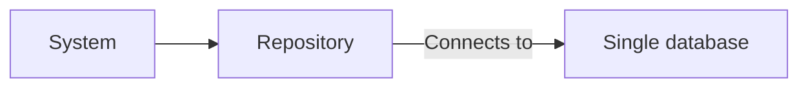
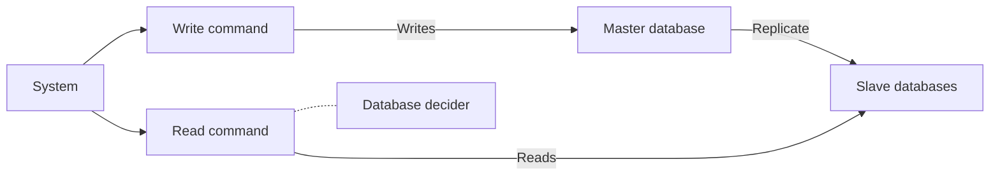
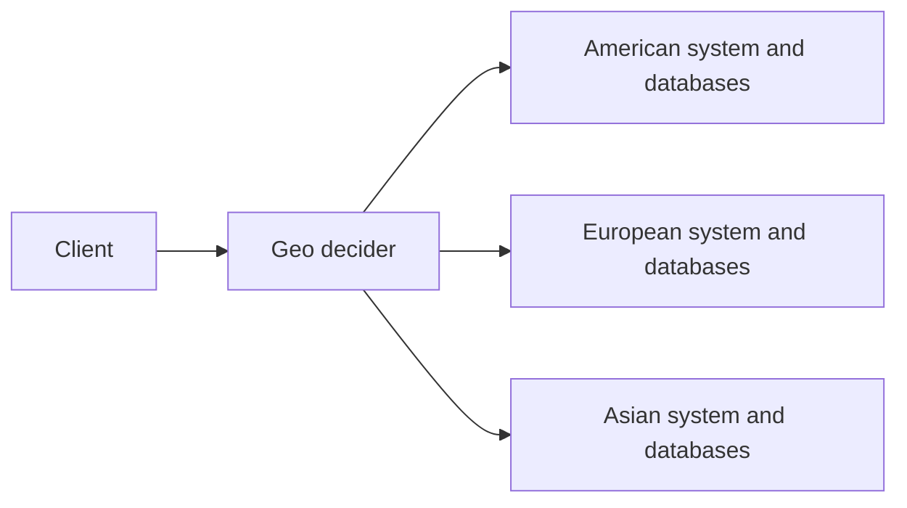
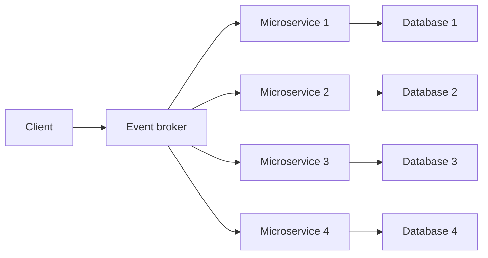
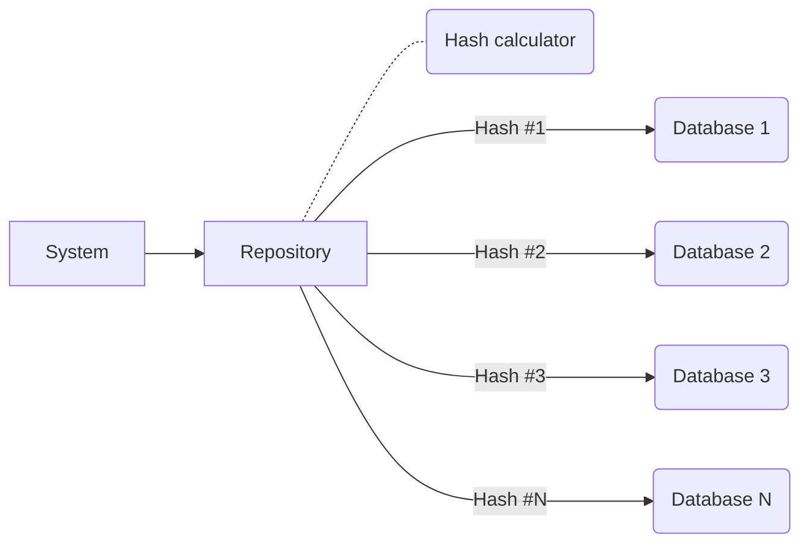

# SQLite Sharding - About this repository
I created this repository to help my studies of database sharding theory and practice. There are explanations and examples throughout this document. 

Even tho this is for self-study, I'd be glad if something ends up being helpful to you!

## Introduction to sharding
The simplest data persistence implementation uses a single database to write and read the data.

As the system needs to handle more requests per second, using a single database to handle all the requests can quickly become a bottleneck. Ignoring caching, one way to handle this situation is using multiple database instances, dividing the workload into multiple services. Simple in theory, but we need to figure out how to work around the data.

### Replicating the data can be the simplest and best option
Using a replication strategy is one of the simplest solutions - all databases have the exact same data. The most common pattern is electing one database to handle all the write operations (master), and their data is replicated into all other databases (slaves), that can be used for all the read operations. This pattern is specially useful for read-intensive systems.


However, there are other strategies available that can be used in conjunction (or in place) of replication, actually splitting the data into different database instances.

### Splitting the data is an amazing alternative, but consider the complexities involved
It's important to understand that splitting the data into different instances can heavily impact how the system works and raises some concerns. For example:

- Simply splitting the data without thinking about each shard availability will create a lot of "single points of failure" and will hurt the availability of the entire system. For example, if a certain data is available only on an specific database instance, and that instance goes down, what will happen with the system?
- If there is any function that requires a system-wide query, all databases will need to be queried and the system will have to merge the results. Such process is usually more complex and costly than querying a single database.
- Trying to execute a `JOIN`-like operation using different databases will require a lot more planning than just writing a JOIN operation. Consider what kind of data is better to stay on the same database instance.

### Strategies of splitting the data
Some systems have geo-sensitivity, so we can apply **geosharding**. For example, imagine a system that handle American and European data as distinct datasets. In this scenario, it's possible to use different databases based on the region. 

There are other ways to split the data by geolocation, for example using radius-based shards in a way that makes finding relevant records near a coordinate easier, so take into consideration the business domain of the system.


Another option is to split the data into **feature-specific shards**. Data is aggregated and splitted according to domain-specific requirements. This style of sharding is commonly achieved when implementing microservices with a database-per-service strategy, even tho microservice is not a requirement for this style of sharding. 

The biggest trick with this strategy is deciding how to handle JOIN-like operations across different databases, so plan accordingly. Aggretating related data into the relevant shards can help mitigate a few problems with those queries.


A more context agnostic approach is splitting the data using **hashed shards**. Each record identifier can be converted into a hash key, and with that it's possible to calculate which database is designated to that specific record.

For example, imagine a scenario with 5 sharded databases where we need to to load a specific record based on it's ID. By applying the modulo operation (%) we can calculate that IDs 0, 5 and 10 are assigned to the first database; IDs 1, 6 and 11 are assigned to the second database, and so forth.

The main weaknesses of this approach are that any query that is not associated by the hash key will require a broadcast query across all databases. Also, to add new databases as shards will require all the data to be redistributed, which most likely will involve making the database temporarily unavailable while reassigning the records to the correct shards.



## About this project
This test application was created to try out **hash sharding** in practice and to benchmark it's performance, using three different executions:
- Run queries with in-memory search performance
- Run queries with a single SQLite database
- Run queries with multiple SQLite databases, sharded through a hash algorithm

The in-memory query was created to calculate how much of the execution is simply the HTTP request overhead, making it easier to compare the single vs sharded query.

One important limitation is that SQLite queries are executed *in-process*, not as separated services. Benchmarking this strategy using full-fledged DBMS instances, specially on separated servers, will show results much closer to a production-level scenario.

## Stress test
Tests were ran using [k6](https://k6.io/docs/testing-guides/api-load-testing/)

Execute POST `/generate-models` at least once before starting the benchmark runs. This will create and feed all the SQLite databases used for the benchmark. If it's not executed, an exception will probably be thrown.

```
k6 run --vus 10000 --iterations 1000000 k6-stress-test.ts
```

